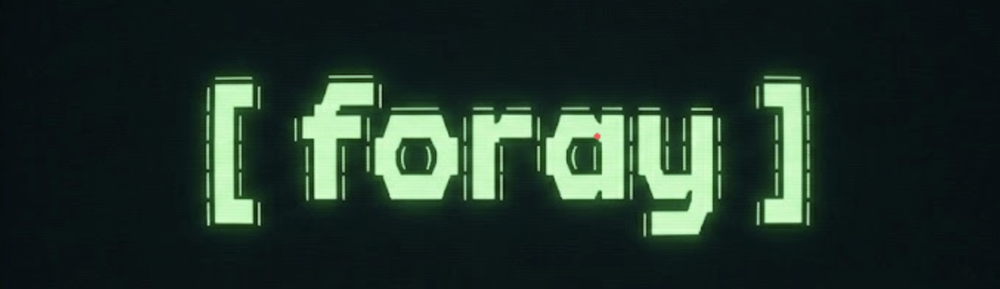
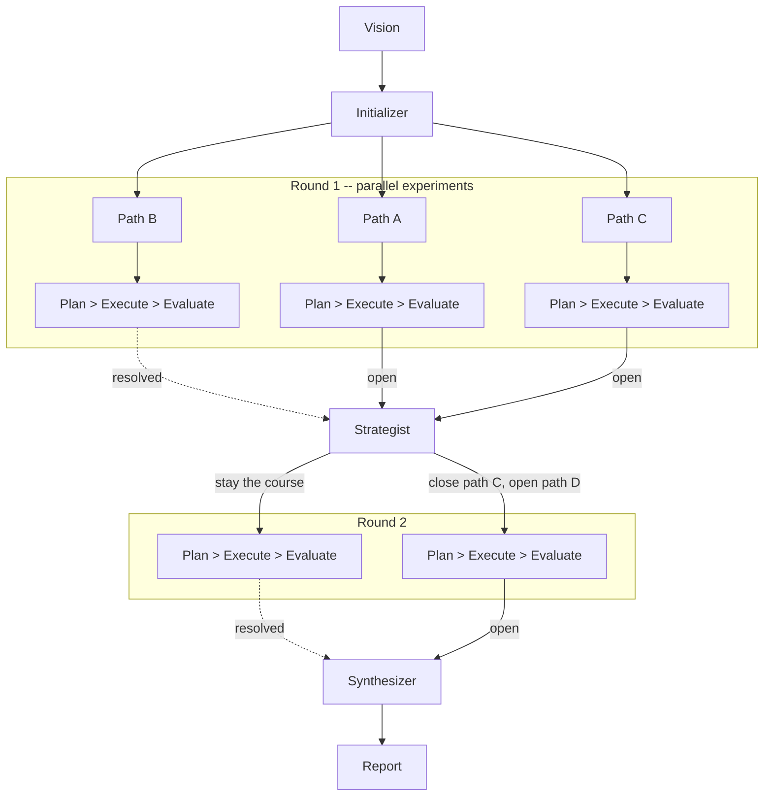

<p align="center">
  
</p>

> **Beta software in active development.** Features and interfaces may change without notice. Foray dispatches multiple AI agents that make real tool calls in your codebase -- this is inherently token-intensive and can consume significant API credits. Experiments run in isolated worktrees and are designed to be non-destructive, but you should review the default tool permissions and use `--deny-tools` to restrict access as needed. Start with short runs (`--hours 0.5 --max-experiments 3`) to calibrate cost and behavior before committing to longer explorations.

Autonomous exploration tool that dispatches Claude Code agents to run experiments in isolated git worktrees and produces a synthesis report. Point it at a codebase with a question, run it overnight, come back to findings.

Foray is for questions that need empirical answers -- where you have hypotheses to test or a goal to reach but multiple possible paths to get there. Instead of speculating, it runs actual experiments in isolated worktrees and synthesizes what it finds.

## How It Works

1. **You provide a vision** -- a question or document describing what you want to explore
2. **Foray identifies exploration paths** -- independent questions worth investigating
3. **For each path, agents run experiments** -- plan, execute in an isolated worktree, evaluate results (experiments run in parallel, up to `--max-concurrent`)
4. **A strategist reviews progress** after each round -- closing dead-end paths, opening new ones based on what's been learned, and reprioritizing based on the vision
5. **A synthesis report** ties everything together when the budget runs out



Experiments run in isolated git worktrees so agents can make changes freely without affecting your working tree. Destructive git operations (push, branch delete, remote modify) are blocked by a git wrapper.

## When to Use Foray

### Testing multiple hypotheses

When you have competing theories and need evidence, not speculation. Foray explores each hypothesis in an isolated worktree -- running code, writing tests, collecting measurements -- and synthesizes what it found.

```bash
foray run --question "Why is checkout slow? Test these hypotheses: N+1 queries, missing indexes, serialization overhead, no caching." --hours 2
```

### Reaching a desired end state when the path is ambiguous

When you know where you want to end up but there are multiple viable approaches. Foray tries each path independently and reports which ones actually work for your codebase.

```bash
foray run --question "Add end-to-end type safety from database to frontend. Try multiple approaches and compare what works." --hours 4
```

The key differentiator vs asking an LLM directly: foray actually *runs* experiments -- it modifies code, executes tests, measures results. You get empirical findings, not theoretical analysis.

## Install

Requires Python 3.12+ and the [Claude Code CLI](https://docs.anthropic.com/en/docs/claude-code) installed and authenticated.

```bash
# Install from source
uv tool install /path/to/foray

# Or from the repo
git clone <repo-url> && cd foray
uv tool install .
```

## Usage

```bash
# Quick exploration with an inline question
foray run --question "What testing patterns does this codebase use?" --hours 0.5 --max-experiments 3

# Deeper exploration with a vision document
foray run --vision VISION.md --hours 8

# Control parallelism (default: 3 concurrent experiments per round)
foray run --question "..." --max-concurrent 5

# Check progress while it runs
foray status

# Read the final report
foray report

# Resume after a crash or Ctrl+C
foray resume
```

### Options

| Flag | Default | Description |
|------|---------|-------------|
| `--vision` | | Path to vision document (markdown) |
| `--question` | | Inline exploration question |
| `--hours` | 8.0 | Time budget |
| `--max-experiments` | 50 | Experiment cap |
| `--model` | claude-sonnet-4-6 | Model for most agents |
| `--evaluator-model` | claude-opus-4-6 | Model for evaluator and strategist |
| `--max-turns` | 30 | Max tool-use turns per agent |
| `--max-concurrent` | 3 | Max parallel experiments per round |
| `--output` | `.foray/` | Output directory |
| `--allow` | | Additional tools to enable (repeatable) |
| `--deny` | | Tools to disable (repeatable) |
| `-y`, `--yes` | | Skip interactive path approval |

### Vision Documents

A vision doc is a markdown file describing what you want to explore. Focus on what you're stuck on and what you'd like to learn:

```markdown
My goal is to understand how the authentication system works and whether
it can be extended to support SSO. Currently, login is username/password
only and the session handling seems fragile.

I'd like to know:
- How sessions are managed and where state lives
- Whether the auth module is decoupled enough to swap providers
- What would break if we added OAuth/SAML
```

### Stopping a Run

- **Ctrl+C** -- kills the current agent and stops the run
- **Touch `.foray/.stop`** -- graceful stop after the current experiment finishes

## Architecture

- **Python orchestrator** handles bookkeeping: state management, scheduling, worktree lifecycle, guardrails
- **Claude Code CLI agents** do the thinking: explore code, write experiments, evaluate results
- **State on disk** as structured JSON in `.foray/` -- survives crashes, enables resume
- **Agents are stateless** -- they read context, do work, write output, and die. No inter-agent communication except through the orchestrator's state files

### Agents

| Agent | Model | Purpose |
|-------|-------|---------|
| Initializer | Sonnet | Scans codebase, reads vision, identifies 2-5 exploration paths |
| Planner | Sonnet | Designs a specific experiment for a path (can signal exhaustion when no viable experiments remain) |
| Executor | Sonnet | Runs the experiment in an isolated worktree |
| Evaluator | **Opus** | Assesses results, tracks hypothesis alignment, rates confidence |
| Strategist | **Opus** | Reviews all paths after each round, steers the run toward the vision |
| Synthesizer | Sonnet | Produces final report from all findings |

The evaluator and strategist use Opus by default because their judgment calls steer the entire run -- bad evaluations waste budget on dead ends, and poor strategic decisions cause path thrashing.

### Safety and Guardrails

- Experiments run in detached-HEAD git worktrees
- A git wrapper intercepts and blocks `push`, `branch -D`, and `remote remove`
- Git integrity checks verify HEAD and branches haven't changed after each experiment
- Deterministic guardrails override evaluator recommendations: resolution requires 2+ successful experiments and at least medium confidence, diverged hypotheses block resolution
- Circuit breakers halt the run after 3 consecutive failures or escalate paths with repeated environment failures to inconclusive
- Methodology repetition detection warns the planner when the last 3 experiments share >70% of their approach tags
- The strategist cannot reopen paths that the evaluator has resolved -- evidence-backed conclusions are respected

## Development

```bash
# Run tests
uv run pytest -v

# Reinstall after changes (--reinstall forces rebuild from source)
uv tool install /path/to/foray --force --reinstall
```
